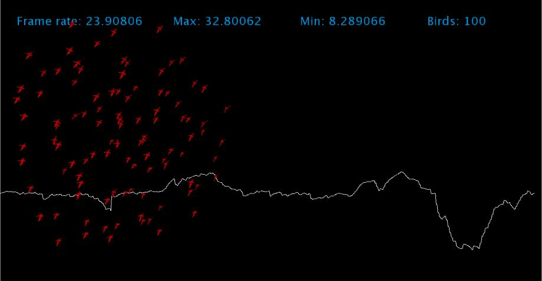
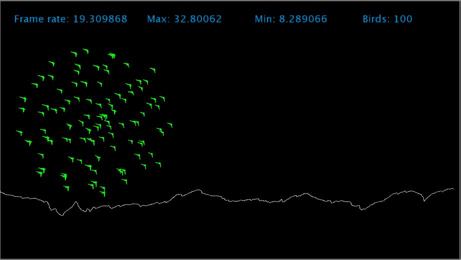

# Taller de mallas poligonales

## Propósito

Estudiar la relación entre las [aplicaciones de mallas poligonales](https://github.com/VisualComputing/representation), su modo de [representación](https://en.wikipedia.org/wiki/Polygon_mesh) (i.e., estructuras de datos empleadas para representar la malla en RAM) y su modo de [renderizado](https://processing.org/tutorials/pshape/) (i.e., modo de transferencia de la geometría a la GPU).

## Tareas

Hacer un benchmark (midiendo los *fps* promedio) de varias representaciones de mallas poligonales para los _boids_ del ejemplo del [FlockOfBoids](https://github.com/VisualComputing/framesjs/tree/processing/examples/Advanced/FlockOfBoids) (requiere la librería [frames](https://github.com/VisualComputing/framesjs/releases), versión ≥ 0.1.0), tanto en modo inmediato como retenido de rendering.

1. Represente la malla del [boid](https://github.com/VisualComputing/framesjs/blob/processing/examples/Advanced/FlockOfBoids/Boid.pde) al menos de ~tres~ dos formas distintas.
2. Renderice el _flock_ en modo inmediato y retenido, implementando la función ```render()``` del [boid](https://github.com/VisualComputing/framesjs/blob/processing/examples/Advanced/FlockOfBoids/Boid.pde).
3. Haga un benchmark que muestre una comparativa de los resultados obtenidos.

### Opcionales

1. Realice la comparativa para diferentes configuraciones de hardware.
2. Realice la comparativa de *fps* sobre una trayectoria de animación para el ojo empleando un [interpolator](https://github.com/VisualComputing/framesjs/tree/processing/examples/Basics/B8_Interpolation2) (en vez de tomar su promedio).
3. Anime la malla, como se hace en el ejemplo de [InteractiveFish](https://github.com/VisualComputing/framesjs/tree/processing/examples/ik/InteractiveFish).
4. Haga [view-frustum-culling](https://github.com/VisualComputing/framesjs/tree/processing/examples/Demos/ViewFrustumCulling) de los _boids_ cuando el ojo se encuentre en tercera persona.

### Profundizaciones

1. Introducir el rol depredador.
2. Cómo se afecta el comportamiento al tener en cuenta el [campo visual](https://es.wikipedia.org/wiki/Campo_visual) (individual)?
3. Implementar el algoritmo del ```flock()``` en [OpenCL](https://en.wikipedia.org/wiki/OpenCL). Ver [acá](https://www.youtube.com/watch?v=4NU37rPOAsk) un ejemplo de *Processing* en el que se que emplea [JOCL](http://www.jocl.org/).

### References

1. [Reynolds, C. W. Flocks, Herds and Schools: A Distributed Behavioral Model. 87](http://www.cs.toronto.edu/~dt/siggraph97-course/cwr87/).
2. Check also this [nice presentation](https://pdfs.semanticscholar.org/73b1/5c60672971c44ef6304a39af19dc963cd0af.pdf) about the paper:
3. There are many online sources, google for more...

## Integrantes

Máximo 3.

Complete la tabla:

|       Integrante         | github nick                                              |
|--------------------------|----------------------------------------------------------|
| Diego Andrés Baquero     | [diegobaqt](https://github.com/diegobaqt)                |
| Andrés Felipe López      | [andreslopzi](https://github.com/andreslopzi)            |

### DEMO

A continuación, se presentan dos capturas de imagen de los modos que mejor desempeño tuvieron.

Por un lado, se tiene el modo 2 (noStroke).



Por otro lado, se muesta una representación Face-Vertex para el modo 1 (noFill).



### Benchmark

|   Representación  |    Modo   | Valor (fps)|
|-------------------|-----------|------------|
| Face-Vertex       | Retenido  | 18.977     |
| Face-Vertex       | Inmediato | 12.867     |
| Vertex-Vertex     | Retenido  | 57.6908    |
| Vertex-Vertex     | Inmediato | 49.3938    |

### Conclusiones

1. De acuerdo a las implementaciones que se realizaron sobre las representaciones Vertex-Vertex y Face-Vertex, se puede observar que los tiempos de respuesta para la representación Vertex-Vertex es más rápida.

2. El Modo Retenido obtiene tiempos más favorables en comparación con el modo inmediato, esto debido a la complejidad del elemento Boid que se está renderizando.

3. Se tomaron tiempos para los diferentes modos implementados en [FlockOfBoids](https://github.com/VisualComputing/framesjs/tree/processing/examples/Advanced/FlockOfBoids) y se concluye que los modos con tiempo de respues más rápidos son: 2 y 1, los cuales muestran solo las caras (noStroke) y solo las aristas (noFill), respectivamente. Adicionalmente, el modo 3, encargado de mostrar sólo los vértices mostró un desempeño significativamente bajo frente a los demás.

## Entrega

* Modo de entrega: Haga [fork](https://help.github.com/articles/fork-a-repo/) de la plantilla e informe la url del repo en la hoja *urls* de la plantilla compartida (una sola vez por grupo). Plazo: 15/4/18 a las 24h.
* Exposición oral en el taller de la siguiente semana (6 minutos: 4 para presentar y 2 para preguntas). Estructura sugerida:
  1. Representaciones estudiadas.
  2. Demo.
  3. Resultados (benchmark).
  4. Conclusiones.
